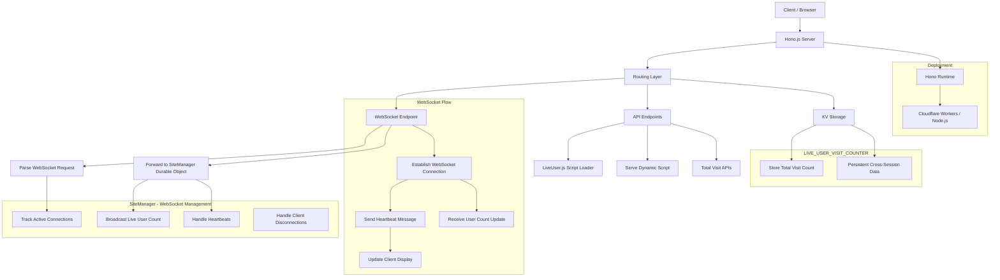

# LiveUser · Real-Time Online User Counter

LiveUser is a lightweight JavaScript widget and WebSocket server that displays real-time online user count and total visit statistics on any webpage. Built with **Hono**, **Durable Objects**, **KV Storage**, and **TailwindCSS**, it's perfect for showcasing live user presence on marketing pages, dashboards, or product sites.

## 🚀 Features

- ✅ **Real-time updates** via WebSocket
- 📊 **Total visit counter** with KV storage persistence
- 🔧 **Customizable script loader** via query params
- 💡 **Auto reconnection** with heartbeat monitoring
- 📦 **No client-side framework dependency**
- 🛠️ Built with [Hono](https://hono.dev/), ideal for Cloudflare Workers

## 🏗️ Architecture



## 📦 Installation

No npm package needed. Simply embed a `<script>` tag and HTML container.

### Basic Usage (Live Users Only)

```html
<div id="liveuser">Loading...</div>
<script src="https://live-user.chendi.workers.dev/liveuser.js"></script>
```

### With Total Visit Counter

```html
<div>Online: <span id="liveuser">0</span></div>
<div>Total: <span id="liveuser_totalvisits">0</span></div>
<script src="https://live-user.chendi.workers.dev/liveuser.js?enableTotalCount=true"></script>
```

This loads the `init-liveuser.js` script dynamically and connects to your WebSocket server.

## ⚙️ Configuration

Customize the script loader via query parameters:

| Parameter             | Description                              | Default                   |
| --------------------- | ---------------------------------------- | ------------------------- |
| `enableTotalCount`    | Enable total visit count tracking        | `false`                   |
| `totalCountElementId` | Element ID for total visit count display | `'liveuser_totalvisits'`  |
| `siteId`              | Unique site/domain identifier            | `'default-site'`          |
| `serverUrl`           | Full WebSocket server URL                | Auto-detected             |
| `displayElementId`    | DOM element ID to show the live count    | `'liveuser'`              |
| `reconnectDelay`      | Delay before reconnecting (in ms)        | `3000`                    |
| `debug`               | Enable debug logs in console             | `false`                   |
| `baseUrl`             | Base URL for loading additional scripts  | Current protocol and host |

### Example with Custom Configuration:

```html
<div id="custom-counter">Loading...</div>
<div id="my-total">0</div>
<script src="https://live-user.chendi.workers.dev/liveuser.js?siteId=my-app&displayElementId=custom-counter&totalCountElementId=my-total&enableTotalCount=true&debug=true"></script>
```
<!-- 
## 🔗 API Endpoints

### Get Total Visit Count

```http
GET /api/total/{siteId}
```

**Response:**
```json
{
  "siteId": "my-site",
  "totalCount": 12345,
  "timestamp": "2025-01-13T10:30:00.000Z"
}
```

### Reset Total Visit Count

```http
POST /api/reset/{siteId}
```

**Response:**
```json
{
  "siteId": "my-site",
  "message": "Total count reset successfully",
  "timestamp": "2025-01-13T10:30:00.000Z"
}
``` -->

## 🖥️ Local Development

### Prerequisites

- Node.js
- Cloudflare Workers with Durable Objects support
- Cloudflare KV namespace (for total visit counting)

### Dev Setup

```bash
npm install
npm run dev
```

### Cloudflare Configuration

1. **Create KV Namespace:**
```bash
npx wrangler kv:namespace create "LIVE_USER_VISIT_COUNTER"
npx wrangler kv:namespace create "LIVE_USER_VISIT_COUNTER" --preview
```

2. **Update wrangler.toml:**
```toml
kv_namespaces = [
  {
    binding = "LIVE_USER_VISIT_COUNTER",
    id = "your-kv-namespace-id",
    preview_id = "your-preview-kv-namespace-id"
  }
]
```

Your Hono app will serve:

- `/` - Demo page with Tailwind UI
- `/liveuser.js` - Configurable JS loader
- `/ws` - WebSocket entry (proxied to Durable Object)
<!-- - `/api/total/{siteId}` - Get total visit count
- `/api/reset/{siteId}` - Reset total visit count -->

## 🧠 Project Structure

```
src/
├── HomePage.tsx           # Main demo page
├── Layout.tsx             # Page layout with Tailwind
├── index.tsx              # Hono app router with KV integration
public/
└── init-liveuser.js       # Core client script with total count support
```

## 🔄 Data Flow

### Live User Count (Durable Objects)
- WebSocket connections managed per site
- Real-time broadcasting of connection count
- Heartbeat monitoring (30s intervals)
- Auto-reconnection on disconnect (3s delay)

### Total Visit Count (KV Storage)
- Incremented on each new WebSocket connection
- Persisted across sessions and deployments
- Accessible via REST API
- Site-specific counting with `siteId` isolation

## 📊 Server Logic

### Durable Object (SiteManager)
Handles:
- WebSocket connection tracking
- Real-time broadcasting of online user count
- Heartbeat responses
- Graceful connection cleanup

### KV Storage Integration
Handles:
- Total visit count persistence
- Cross-session data retention
- Site-specific visit tracking
- API endpoint data retrieval

## 🔐 Production Recommendations

- Use Cloudflare Workers for edge-deployed WebSocket support
- Configure KV storage for visit count persistence
- Add authentication or domain restrictions if needed
- Monitor KV usage for cost optimization
- Set up alerts for unusual traffic patterns

## 📈 Monitoring & Analytics

The system provides both real-time and historical data:

- **Real-time**: Live user count via WebSocket
- **Historical**: Total visit count via KV storage
- **API Access**: Programmatic access to visit statistics
- **Debug Mode**: Detailed logging for troubleshooting

## License

[MIT](./LICENSE) License © 2025-PRESENT [wudi](https://github.com/WuChenDi)
