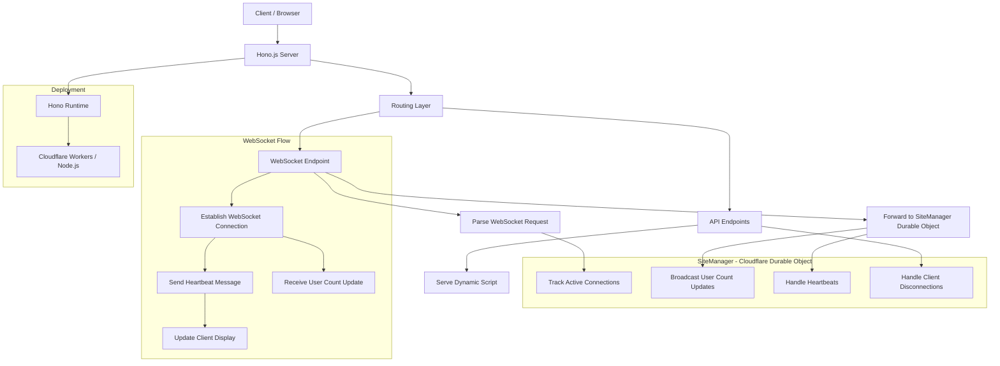

# LiveUser · Real-Time Online User Counter

LiveUser is a lightweight JavaScript widget and WebSocket server that displays real-time online user count on any webpage. Built with **Hono**, **Durable Objects**, and **TailwindCSS**, it’s perfect for showcasing live user presence on marketing pages, dashboards, or product sites.

## 🚀 Features

- ✅ **Real-time updates** via WebSocket
- 🔧 **Customizable script loader** via query params
- 💡 **Auto reconnection** with heartbeat monitoring
- 📦 **No client-side framework dependency**
- 🛠️ Built with [Hono](https://hono.dev/), ideal for Cloudflare Workers

## 🏗️ Architecture



## 📦 Installation

No npm package needed. Simply embed a `<script>` tag and HTML container.

### Minimal Usage

```html
<div id="liveuser">Loading...</div>
<script src="https://live-user.chendi.workers.dev/liveuser.js"></script>
````

This loads the `init-liveuser.js` script dynamically and connects to your WebSocket server.

## ⚙️ Configuration

Customize the script loader via query parameters:

| Parameter          | Description                           | Default          |
| ------------------ | ------------------------------------- | ---------------- |
| `siteId`           | Unique site/domain identifier         | `'default-site'` |
| `serverUrl`        | Full WebSocket server URL             | Auto-detected    |
| `displayElementId` | DOM element ID to show the user count | `'liveuser'`     |
| `reconnectDelay`   | Delay before reconnecting (in ms)     | `3000`           |
| `debug`            | Enable debug logs in console          | `false`          |

### Example with Custom ID and Debug Mode:

```html
<div id="custom-counter">Loading...</div>
<script src="https://live-user.chendi.workers.dev/liveuser.js?siteId=my-app&displayElementId=custom-counter&debug=true"></script>
```

## 🖥️ Local Development

### Prerequisites

- Node.js
- Cloudflare Workers with Durable Objects support

### Dev Setup

```bash
npm install
npm run dev
```

Your Hono app will serve:

- `/` - Demo page with Tailwind UI
- `/liveuser.js` - Configurable JS loader
- `/ws` - WebSocket entry (proxied to Durable Object)

## 🧠 Project Structure

```
src/
├── HomePage.tsx           # Main demo page
├── Layout.tsx             # Page layout with Tailwind
├── index.tsx              # Hono app router
public/
└── init-liveuser.js       # Core client script (no build needed)
```

The actual WebSocket logic is handled inside the Durable Object class `SiteManager`.

## 🔄 Heartbeat & Reconnect Logic

- Sends heartbeat every 30s
- Reconnects on disconnect (default: 3s delay)
- Each connection triggers count update to all clients

## 📊 Server Logic (Durable Object)

Handles:

- WebSocket connection tracking
- Real-time broadcasting of online user count
- Responds to heartbeats
- Graceful cleanup on disconnect

## 🔐 Production Recommendations

- Use Cloudflare Workers for edge-deployed WebSocket support
- Add authentication or domain restrictions if needed
- Optionally persist user counts with KV storage

## License

[MIT](./LICENSE) License © 2025-PRESENT [wudi](https://github.com/WuChenDi)
